# p101 library function graph

Generated from active `libraries/lib_*` directories. `_to_delete` is excluded.

## Summary

- Wrapper/function nodes: `1185`
- Edges: `1318`
- Wrapper-to-wrapper edges: `126`
- Wrapper-to-native wrapped-call edges: `958`
- Domains: `42`

## Playground-level graph

```mermaid
flowchart LR
  p101_c_playground["p101-c-playground\n608 wrappers"]
  c_atomics["c/atomics"] --> p101_c_playground
  c_cli_parsing["c/cli-parsing"] --> p101_c_playground
  c_control_flow["c/control-flow"] --> p101_c_playground
  c_control_flow_extensions["c/control-flow-extensions"] --> p101_c_playground
  c_conversion["c/conversion"] --> p101_c_playground
  c_ctype["c/ctype"] --> p101_c_playground
  c_ctype_extensions["c/ctype-extensions"] --> p101_c_playground
  c_inttypes["c/inttypes"] --> p101_c_playground
  c_locale["c/locale"] --> p101_c_playground
  c_locale_extensions["c/locale-extensions"] --> p101_c_playground
  c_math["c/math"] --> p101_c_playground
  c_math_extensions["c/math-extensions"] --> p101_c_playground
  c_stdio["c/stdio"] --> p101_c_playground
  c_stdio_extensions["c/stdio-extensions"] --> p101_c_playground
  c_stdlib["c/stdlib"] --> p101_c_playground
  c_stdlib_extensions["c/stdlib-extensions"] --> p101_c_playground
  c_string["c/string"] --> p101_c_playground
  c_string_extensions["c/string-extensions"] --> p101_c_playground
  c_time["c/time"] --> p101_c_playground
  c_time_extensions["c/time-extensions"] --> p101_c_playground
  c_wchar["c/wchar"] --> p101_c_playground
  c_wchar_extensions["c/wchar-extensions"] --> p101_c_playground
  c_wctype["c/wctype"] --> p101_c_playground
  c_wctype_extensions["c/wctype-extensions"] --> p101_c_playground
  p101_systems_playground["p101-systems-playground\n361 wrappers"]
  systems_async_io["systems/async-io"] --> p101_systems_playground
  systems_file_io["systems/file-io"] --> p101_systems_playground
  systems_io_multiplexing["systems/io-multiplexing"] --> p101_systems_playground
  systems_ipc["systems/ipc"] --> p101_systems_playground
  systems_logging_diagnostics["systems/logging-diagnostics"] --> p101_systems_playground
  systems_misc_runtime["systems/misc-runtime"] --> p101_systems_playground
  systems_platform_admin["systems/platform-admin"] --> p101_systems_playground
  systems_process_signal["systems/process-signal"] --> p101_systems_playground
  systems_resource_time_memory["systems/resource-time-memory"] --> p101_systems_playground
  systems_threading["systems/threading"] --> p101_systems_playground
  systems_users_terminals["systems/users-terminals"] --> p101_systems_playground
  p101_network_playground["p101-network-playground\n89 wrappers"]
  network["network"] --> p101_network_playground
  p101_tooling_playground["p101-tooling-playground\n127 wrappers"]
  support_environment["support/environment"] --> p101_tooling_playground
  support_error["support/error"] --> p101_tooling_playground
  support_fsm["support/fsm"] --> p101_tooling_playground
  support_instrumentation["support/instrumentation"] --> p101_tooling_playground
  support_util["support/util"] --> p101_tooling_playground
  tooling_c_facts["tooling/c-facts"] --> p101_tooling_playground
```

## Recommended playground cuts

| Playground | Function count | Domains | Purpose |
| --- | ---: | --- | --- |
| `p101-c-playground` | 608 | `c/atomics`, `c/cli-parsing`, `c/control-flow`, `c/control-flow-extensions`, `c/conversion`, `c/ctype`, `c/ctype-extensions`, `c/inttypes`, `c/locale`, `c/locale-extensions`, `c/math`, `c/math-extensions`, `c/stdio`, `c/stdio-extensions`, `c/stdlib`, `c/stdlib-extensions`, `c/string`, `c/string-extensions`, `c/time`, `c/time-extensions`, `c/wchar`, `c/wchar-extensions`, `c/wctype`, `c/wctype-extensions` | C language, memory, strings, integers, parsing, atomics, and portable diagnostics. |
| `p101-systems-playground` | 361 | `systems/async-io`, `systems/file-io`, `systems/io-multiplexing`, `systems/ipc`, `systems/logging-diagnostics`, `systems/misc-runtime`, `systems/platform-admin`, `systems/process-signal`, `systems/resource-time-memory`, `systems/threading`, `systems/users-terminals` | POSIX files, processes, signals, resources, terminals, pthreads, IPC, and I/O multiplexing. |
| `p101-network-playground` | 89 | `network` | Sockets, address resolution, interfaces, resolver/name helpers, and byte-order/network conversions. |
| `p101-tooling-playground` | 127 | `support/environment`, `support/error`, `support/fsm`, `support/instrumentation`, `support/util`, `tooling/c-facts` | p101 support libraries: env/error/fsm/facts/instrumentation and how the tools observe programs. |

## Candidate specialized playgrounds

| Candidate | Function count | Domains | Why it exists |
| --- | ---: | --- | --- |
| `p101-process-playground` | 153 | `systems/process-signal`, `systems/file-io` | fork, exec, wait, spawn, signal handling, CLOEXEC, inherited resources, and failure-path cleanup. |
| `p101-file-io-playground` | 126 | `systems/file-io`, `systems/async-io` | File descriptors, streams, directories, paths, short reads/writes, descriptor ownership, and exec inheritance. |
| `p101-observability-playground` | 126 | `support/environment`, `support/error`, `support/fsm`, `support/instrumentation`, `tooling/c-facts` | env/error/fsm/facts, call traces, resource logs, fault injection, and writing small analyses over event streams. |
| `p101-network-playground` | 89 | `network` | TCP/UDP sockets, address resolution, interfaces, resolver helpers, protocol databases, and byte ordering. |
| `p101-threading-playground` | 85 | `systems/threading`, `c/atomics` | Threads, mutexes, condition variables, cancellation, cleanup, atomics, and race-oriented resource handling. |
| `p101-ipc-playground` | 21 | `systems/ipc`, `systems/io-multiplexing` | POSIX and XSI IPC: message queues, semaphores, shared memory, keys, cleanup, and permission mistakes. |

## Curriculum reading

- The existing wrapper examples can collapse into playground tracks once each cluster has a working "good path" plus focused defect labs.
- `systems/ipc` is big enough to justify an IPC unit, especially when paired with `systems/io-multiplexing` so students see blocking, readiness, cleanup, and ownership together.
- `systems/file-io`, `systems/threading`, and `network` are the three largest non-C clusters; they should not be squeezed into one general systems lab.
- `support/instrumentation` plus `tooling/c-facts` should become a meta/tooling playground: students learn that the wrappers are observable APIs, not just safer spelling.

## Counts by library

| Library | Functions |
| --- | ---: |
| `lib_c` | 442 |
| `lib_c_facts` | 3 |
| `lib_convert` | 32 |
| `lib_env` | 59 |
| `lib_error` | 47 |
| `lib_fsm` | 17 |
| `lib_posix` | 353 |
| `lib_posix_optional` | 52 |
| `lib_posix_xsi` | 90 |
| `lib_unix` | 89 |
| `lib_util` | 1 |

## Domain clusters

| Domain | Functions | Libraries | Playground signal |
| --- | ---: | --- | --- |
| `c/atomics` | 8 | `lib_c`:8 | C playground |
| `c/cli-parsing` | 2 | `lib_unix`:2 | C playground |
| `c/control-flow` | 4 | `lib_c`:4 | C playground |
| `c/control-flow-extensions` | 2 | `lib_posix`:2 | C playground |
| `c/conversion` | 32 | `lib_convert`:32 | C playground |
| `c/ctype` | 14 | `lib_c`:14 | C playground |
| `c/ctype-extensions` | 14 | `lib_posix`:14 | C playground |
| `c/inttypes` | 6 | `lib_c`:6 | C playground |
| `c/locale` | 2 | `lib_c`:2 | C playground |
| `c/locale-extensions` | 4 | `lib_posix`:4 | C playground |
| `c/math` | 242 | `lib_c`:242 | C playground |
| `c/math-extensions` | 6 | `lib_posix_xsi`:6 | C playground |
| `c/stdio` | 40 | `lib_c`:40 | C playground |
| `c/stdio-extensions` | 22 | `lib_posix`:19, `lib_unix`:3 | C playground |
| `c/stdlib` | 31 | `lib_c`:31 | C playground |
| `c/stdlib-extensions` | 24 | `lib_posix`:5, `lib_posix_optional`:1, `lib_posix_xsi`:13, `lib_unix`:5 | C playground |
| `c/string` | 19 | `lib_c`:19 | C playground |
| `c/string-extensions` | 19 | `lib_posix`:14, `lib_posix_xsi`:2, `lib_unix`:3 | C playground |
| `c/time` | 5 | `lib_c`:5 | C playground |
| `c/time-extensions` | 9 | `lib_posix`:8, `lib_posix_xsi`:1 | C playground |
| `c/wchar` | 53 | `lib_c`:53 | C playground |
| `c/wchar-extensions` | 14 | `lib_posix`:12, `lib_posix_xsi`:2 | C playground |
| `c/wctype` | 18 | `lib_c`:18 | C playground |
| `c/wctype-extensions` | 18 | `lib_posix`:18 | C playground |
| `network` | 89 | `lib_posix`:42, `lib_unix`:47 | network playground cluster |
| `support/environment` | 18 | `lib_env`:18 | tooling/meta playground |
| `support/error` | 47 | `lib_error`:47 | tooling/meta playground |
| `support/fsm` | 17 | `lib_fsm`:17 | tooling/meta playground |
| `support/instrumentation` | 41 | `lib_env`:41 | tooling/meta playground |
| `support/util` | 1 | `lib_util`:1 | tooling/meta playground |
| `systems/async-io` | 8 | `lib_posix`:7, `lib_posix_optional`:1 | systems playground |
| `systems/file-io` | 118 | `lib_posix`:96, `lib_posix_xsi`:16, `lib_unix`:6 | systems playground |
| `systems/io-multiplexing` | 3 | `lib_posix`:3 | systems reference/advanced cluster |
| `systems/ipc` | 18 | `lib_posix`:6, `lib_posix_xsi`:12 | strong IPC playground cluster |
| `systems/logging-diagnostics` | 12 | `lib_posix_xsi`:4, `lib_unix`:8 | systems playground |
| `systems/misc-runtime` | 36 | `lib_posix`:16, `lib_posix_xsi`:20 | systems playground |
| `systems/platform-admin` | 8 | `lib_posix`:1, `lib_unix`:7 | systems playground |
| `systems/process-signal` | 35 | `lib_posix`:16, `lib_posix_optional`:17, `lib_posix_xsi`:2 | systems playground |
| `systems/resource-time-memory` | 19 | `lib_posix`:4, `lib_posix_optional`:7, `lib_posix_xsi`:6, `lib_unix`:2 | systems playground |
| `systems/threading` | 77 | `lib_posix`:51, `lib_posix_optional`:26 | systems playground |
| `systems/users-terminals` | 27 | `lib_posix`:15, `lib_posix_xsi`:6, `lib_unix`:6 | systems playground |
| `tooling/c-facts` | 3 | `lib_c_facts`:3 | tooling/meta playground |

## Large clusters and representative functions

### `c/math` (242)

`p101_acos`, `p101_acosf`, `p101_acosh`, `p101_acoshf`, `p101_acoshl`, `p101_acosl`, `p101_asin`, `p101_asinf`, `p101_asinh`, `p101_asinhf`, `p101_asinhl`, `p101_asinl`, `p101_atan`, `p101_atan2`, `p101_atan2f`, `p101_atan2l`, `p101_atanf`, `p101_atanh`, `p101_atanhf`, `p101_atanhl`, `p101_atanl`, `p101_cabs`, `p101_cabsf`, `p101_cabsl`, `p101_cacos`, `p101_cacosf`, `p101_cacosh`, `p101_cacoshf`, `p101_cacoshl`, `p101_cacosl`, `p101_carg`, `p101_cargf`, `p101_cargl`, `p101_casin`, `p101_casinf` … +207 more

### `systems/file-io` (118)

`p101__exit`, `p101_access`, `p101_alarm`, `p101_alphasort`, `p101_basename`, `p101_chdir`, `p101_chmod`, `p101_chown`, `p101_close`, `p101_closedir`, `p101_confstr`, `p101_creat`, `p101_crypt`, `p101_dirfd`, `p101_dirname`, `p101_dup`, `p101_dup2`, `p101_endusershell`, `p101_execv`, `p101_execve`, `p101_execvp`, `p101_faccessat`, `p101_fchdir`, `p101_fchmod`, `p101_fchmodat`, `p101_fchown`, `p101_fchownat`, `p101_fcntl`, `p101_fdopendir`, `p101_fnmatch`, `p101_fork`, `p101_fpathconf`, `p101_fstat`, `p101_fstatat`, `p101_fstatvfs` … +83 more

### `network` (89)

`p101_accept`, `p101_b64_ntop`, `p101_b64_pton`, `p101_bind`, `p101_connect`, `p101_dn_comp`, `p101_dn_expand`, `p101_dn_skipname`, `p101_endhostent`, `p101_endnetent`, `p101_endprotoent`, `p101_endservent`, `p101_ether_aton`, `p101_ether_hostton`, `p101_ether_line`, `p101_ether_ntoa`, `p101_ether_ntohost`, `p101_freeaddrinfo`, `p101_freeifaddrs`, `p101_gai_strerror`, `p101_getaddrinfo`, `p101_getifaddrs`, `p101_getnameinfo`, `p101_getpeername`, `p101_getsockname`, `p101_getsockopt`, `p101_htonl`, `p101_htons`, `p101_if_freenameindex`, `p101_if_indextoname`, `p101_if_nameindex`, `p101_if_nametoindex`, `p101_inet_addr`, `p101_inet_aton`, `p101_inet_lnaof` … +54 more

### `systems/threading` (77)

`p101_pthread_atfork`, `p101_pthread_attr_destroy`, `p101_pthread_attr_getdetachstate`, `p101_pthread_attr_getguardsize`, `p101_pthread_attr_getinheritsched`, `p101_pthread_attr_getschedparam`, `p101_pthread_attr_getschedpolicy`, `p101_pthread_attr_getscope`, `p101_pthread_attr_getstack`, `p101_pthread_attr_getstacksize`, `p101_pthread_attr_init`, `p101_pthread_attr_setdetachstate`, `p101_pthread_attr_setguardsize`, `p101_pthread_attr_setinheritsched`, `p101_pthread_attr_setschedparam`, `p101_pthread_attr_setschedpolicy`, `p101_pthread_attr_setscope`, `p101_pthread_attr_setstack`, `p101_pthread_attr_setstacksize`, `p101_pthread_cancel`, `p101_pthread_cond_broadcast`, `p101_pthread_cond_destroy`, `p101_pthread_cond_init`, `p101_pthread_cond_signal`, `p101_pthread_cond_timedwait`, `p101_pthread_cond_wait`, `p101_pthread_condattr_destroy`, `p101_pthread_condattr_getpshared`, `p101_pthread_condattr_init`, `p101_pthread_condattr_setpshared`, `p101_pthread_create`, `p101_pthread_detach`, `p101_pthread_equal`, `p101_pthread_exit`, `p101_pthread_getschedparam` … +42 more

### `c/wchar` (53)

`p101_btowc`, `p101_fgetwc`, `p101_fgetws`, `p101_fputwc`, `p101_fputws`, `p101_fwide`, `p101_getwc`, `p101_getwchar`, `p101_mbrlen`, `p101_mbrtowc`, `p101_mbsinit`, `p101_mbsrtowcs`, `p101_putwc`, `p101_putwchar`, `p101_ungetwc`, `p101_vfwprintf`, `p101_vfwscanf`, `p101_vswprintf`, `p101_vswscanf`, `p101_vwprintf`, `p101_vwscanf`, `p101_wcrtomb`, `p101_wcscat`, `p101_wcschr`, `p101_wcscmp`, `p101_wcscoll`, `p101_wcscpy`, `p101_wcscspn`, `p101_wcsftime`, `p101_wcslen`, `p101_wcsncat`, `p101_wcsncmp`, `p101_wcsncpy`, `p101_wcspbrk`, `p101_wcsrchr` … +18 more

### `support/error` (47)

`p101_check_equals_int`, `p101_check_equals_intmax`, `p101_check_equals_string`, `p101_check_equals_uintmax`, `p101_check_greater_than_double`, `p101_check_greater_than_int`, `p101_check_greater_than_intmax`, `p101_check_greater_than_uintmax`, `p101_check_in_range_double`, `p101_check_in_range_int`, `p101_check_in_range_intmax`, `p101_check_in_range_uintmax`, `p101_check_less_than_double`, `p101_check_less_than_int`, `p101_check_less_than_intmax`, `p101_check_less_than_uintmax`, `p101_check_not_equals_int`, `p101_check_not_equals_intmax`, `p101_check_not_equals_string`, `p101_check_not_equals_uintmax`, `p101_check_not_null`, `p101_check_null`, `p101_errno_get_errno`, `p101_error_check`, `p101_error_copy`, `p101_error_create`, `p101_error_default_error_reporter`, `p101_error_destroy`, `p101_error_errno`, `p101_error_get_code`, `p101_error_get_errno`, `p101_error_get_file_name`, `p101_error_get_function_name`, `p101_error_get_line_number`, `p101_error_get_message` … +12 more

### `support/instrumentation` (41)

`p101_env_alloc_event_name`, `p101_env_alloc_log_observer`, `p101_env_alloc_notify`, `p101_env_call_log_observer`, `p101_env_call_notify`, `p101_env_check_fault`, `p101_env_configure_call_log_from_environment`, `p101_env_configure_fault_from_environment`, `p101_env_configure_fd_log_from_environment`, `p101_env_default_tracer`, `p101_env_enable_fd_tracking`, `p101_env_environment_fault_injector`, `p101_env_exec_fd_log`, `p101_env_fault_state_destroy`, `p101_env_fd_log_observer`, `p101_env_fd_notify`, `p101_env_get_exit_tracer`, `p101_env_get_tracer`, `p101_env_get_tracer_data`, `p101_env_log_fault_hit`, `p101_env_set_alloc_log`, `p101_env_set_alloc_observer`, `p101_env_set_call_log`, `p101_env_set_call_observer`, `p101_env_set_exit_tracer`, `p101_env_set_fault_injector`, `p101_env_set_fd_log`, `p101_env_set_fd_observer`, `p101_env_set_tracer`, `p101_env_set_tracer_data`, `p101_env_trace`, `p101_env_trace_call`, `p101_env_trace_call_exit`, `p101_env_trace_exit`, `p101_env_track_alloc` … +6 more

### `c/stdio` (40)

`p101_clearerr`, `p101_fclose`, `p101_feof`, `p101_ferror`, `p101_fflush`, `p101_fgetc`, `p101_fgetpos`, `p101_fgets`, `p101_fopen`, `p101_fprintf`, `p101_fputc`, `p101_fputs`, `p101_fread`, `p101_freopen`, `p101_fscanf`, `p101_fseek`, `p101_fsetpos`, `p101_ftell`, `p101_fwrite`, `p101_getc`, `p101_getchar`, `p101_perror`, `p101_printf`, `p101_putc`, `p101_putchar`, `p101_puts`, `p101_remove`, `p101_rename`, `p101_scanf`, `p101_setvbuf`, `p101_snprintf`, `p101_sscanf`, `p101_tmpfile`, `p101_ungetc`, `p101_vfprintf` … +5 more

### `systems/misc-runtime` (36)

`p101_catclose`, `p101_catgets`, `p101_catopen`, `p101_dbm_clearerr`, `p101_dbm_close`, `p101_dbm_delete`, `p101_dbm_error`, `p101_dbm_fetch`, `p101_dbm_firstkey`, `p101_dbm_nextkey`, `p101_dbm_open`, `p101_dbm_store`, `p101_dlclose`, `p101_dlerror`, `p101_dlopen`, `p101_dlsym`, `p101_hcreate`, `p101_hdestroy`, `p101_hsearch`, `p101_iconv`, `p101_iconv_close`, `p101_iconv_open`, `p101_insque`, `p101_lfind`, `p101_lsearch`, `p101_nl_langinfo`, `p101_nl_langinfo_l`, `p101_regcomp`, `p101_regerror`, `p101_regexec`, `p101_regfree`, `p101_remque`, `p101_tdelete`, `p101_tfind`, `p101_tsearch` … +1 more

### `systems/process-signal` (35)

`p101_kill`, `p101_killpg`, `p101_posix_spawn`, `p101_posix_spawn_file_actions_addclose`, `p101_posix_spawn_file_actions_adddup2`, `p101_posix_spawn_file_actions_addopen`, `p101_posix_spawn_file_actions_destroy`, `p101_posix_spawn_file_actions_init`, `p101_posix_spawnattr_destroy`, `p101_posix_spawnattr_getflags`, `p101_posix_spawnattr_getpgroup`, `p101_posix_spawnattr_getsigdefault`, `p101_posix_spawnattr_getsigmask`, `p101_posix_spawnattr_init`, `p101_posix_spawnattr_setflags`, `p101_posix_spawnattr_setpgroup`, `p101_posix_spawnattr_setsigdefault`, `p101_posix_spawnattr_setsigmask`, `p101_posix_spawnp`, `p101_pthread_kill`, `p101_pthread_sigmask`, `p101_sigaction`, `p101_sigaddset`, `p101_sigaltstack`, `p101_sigdelset`, `p101_sigemptyset`, `p101_sigfillset`, `p101_sigismember`, `p101_sigpending`, `p101_sigprocmask`, `p101_sigsuspend`, `p101_sigwait`, `p101_wait`, `p101_waitid`, `p101_waitpid`

### `c/conversion` (32)

`p101_parse_char`, `p101_parse_int`, `p101_parse_int16_t`, `p101_parse_int32_t`, `p101_parse_int8_t`, `p101_parse_long`, `p101_parse_long_long`, `p101_parse_negative_char`, `p101_parse_negative_int`, `p101_parse_negative_int16_t_short`, `p101_parse_negative_int32_t_int`, `p101_parse_negative_int8_t_char`, `p101_parse_negative_long`, `p101_parse_negative_long_long`, `p101_parse_negative_short`, `p101_parse_positive_char`, `p101_parse_positive_int`, `p101_parse_positive_int16_t_short`, `p101_parse_positive_int32_t_int`, `p101_parse_positive_int8_t_char`, `p101_parse_positive_long`, `p101_parse_positive_long_long`, `p101_parse_positive_short`, `p101_parse_short`, `p101_parse_uint16_t`, `p101_parse_uint32_t`, `p101_parse_uint8_t`, `p101_parse_unsigned_char`, `p101_parse_unsigned_int`, `p101_parse_unsigned_long`, `p101_parse_unsigned_long_long`, `p101_parse_unsigned_short`

### `c/stdlib` (31)

`p101_abort`, `p101_abs`, `p101_atexit`, `p101_bsearch`, `p101_calloc`, `p101_div`, `p101_exit`, `p101_exit_immediately`, `p101_free`, `p101_getenv`, `p101_labs`, `p101_ldiv`, `p101_llabs`, `p101_lldiv`, `p101_malloc`, `p101_mblen`, `p101_mbstowcs`, `p101_mbtowc`, `p101_pointer_value_for_log`, `p101_qsort`, `p101_realloc`, `p101_strtod`, `p101_strtof`, `p101_strtol`, `p101_strtold`, `p101_strtoll`, `p101_strtoul`, `p101_strtoull`, `p101_system`, `p101_wcstombs`, `p101_wctomb`

### `systems/users-terminals` (27)

`p101_cfgetispeed`, `p101_cfgetospeed`, `p101_cfmakeraw`, `p101_cfsetispeed`, `p101_cfsetospeed`, `p101_cfsetspeed`, `p101_endttyent`, `p101_endutxent`, `p101_getgrgid_r`, `p101_getgrnam_r`, `p101_getpwnam_r`, `p101_getpwuid_r`, `p101_getttyent`, `p101_getttynam`, `p101_getutxent`, `p101_getutxid`, `p101_getutxline`, `p101_pututxline`, `p101_setttyent`, `p101_setutxent`, `p101_tcdrain`, `p101_tcflow`, `p101_tcflush`, `p101_tcgetattr`, `p101_tcgetsid`, `p101_tcsendbreak`, `p101_tcsetattr`

### `c/stdlib-extensions` (24)

`p101_a64l`, `p101_arc4random`, `p101_arc4random_buf`, `p101_arc4random_uniform`, `p101_getloadavg`, `p101_getsubopt`, `p101_grantpt`, `p101_initstate`, `p101_l64a`, `p101_mkdtemp`, `p101_mkstemp`, `p101_posix_memalign`, `p101_posix_openpt`, `p101_ptsname`, `p101_putenv`, `p101_realpath`, `p101_rpmatch`, `p101_seed48`, `p101_setenv`, `p101_setstate`, `p101_srand48`, `p101_srandom`, `p101_unlockpt`, `p101_unsetenv`

### `c/stdio-extensions` (22)

`p101_fdopen`, `p101_fileno`, `p101_flockfile`, `p101_fmemopen`, `p101_fpurge`, `p101_fseeko`, `p101_ftello`, `p101_ftrylockfile`, `p101_funlockfile`, `p101_getc_unlocked`, `p101_getchar_unlocked`, `p101_getdelim`, `p101_getline`, `p101_open_memstream`, `p101_pclose`, `p101_popen`, `p101_putc_unlocked`, `p101_putchar_unlocked`, `p101_renameat`, `p101_setbuffer`, `p101_setlinebuf`, `p101_vdprintf`

### `c/string` (19)

`p101_memchr`, `p101_memcmp`, `p101_memcpy`, `p101_memmove`, `p101_memset`, `p101_strchr`, `p101_strcmp`, `p101_strcoll`, `p101_strcspn`, `p101_strerror`, `p101_strlen`, `p101_strncat`, `p101_strncmp`, `p101_strncpy`, `p101_strpbrk`, `p101_strrchr`, `p101_strspn`, `p101_strstr`, `p101_strxfrm`

### `c/string-extensions` (19)

`p101_ffs`, `p101_memccpy`, `p101_stpcpy`, `p101_stpncpy`, `p101_strcasecmp`, `p101_strcasecmp_l`, `p101_strcasestr`, `p101_strchrnul`, `p101_strcoll_l`, `p101_strdup`, `p101_strerror_r`, `p101_strncasecmp`, `p101_strncasecmp_l`, `p101_strndup`, `p101_strnlen`, `p101_strsep`, `p101_strsignal`, `p101_strtok_r`, `p101_strxfrm_l`

### `systems/resource-time-memory` (19)

`p101_getpriority`, `p101_getrlimit`, `p101_getrusage`, `p101_mlock`, `p101_mlockall`, `p101_mmap`, `p101_mprotect`, `p101_msync`, `p101_munlock`, `p101_munlockall`, `p101_munmap`, `p101_ntp_adjtime`, `p101_ntp_gettime`, `p101_posix_madvise`, `p101_setpriority`, `p101_setrlimit`, `p101_shm_open`, `p101_shm_unlink`, `p101_times`

### `c/wctype` (18)

`p101_iswalnum`, `p101_iswalpha`, `p101_iswblank`, `p101_iswcntrl`, `p101_iswctype`, `p101_iswdigit`, `p101_iswgraph`, `p101_iswlower`, `p101_iswprint`, `p101_iswpunct`, `p101_iswspace`, `p101_iswupper`, `p101_iswxdigit`, `p101_towctrans`, `p101_towlower`, `p101_towupper`, `p101_wctrans`, `p101_wctype`

### `c/wctype-extensions` (18)

`p101_iswalnum_l`, `p101_iswalpha_l`, `p101_iswblank_l`, `p101_iswcntrl_l`, `p101_iswctype_l`, `p101_iswdigit_l`, `p101_iswgraph_l`, `p101_iswlower_l`, `p101_iswprint_l`, `p101_iswpunct_l`, `p101_iswspace_l`, `p101_iswupper_l`, `p101_iswxdigit_l`, `p101_towctrans_l`, `p101_towlower_l`, `p101_towupper_l`, `p101_wctrans_l`, `p101_wctype_l`

### `support/environment` (18)

`p101_env_close_owned_resource_log`, `p101_env_configure_from_environment`, `p101_env_create`, `p101_env_destroy`, `p101_env_dup`, `p101_env_exec_scan_limit`, `p101_env_flag_on`, `p101_env_fork_log`, `p101_env_get_label`, `p101_env_init`, `p101_env_log_append_char`, `p101_env_log_append_field`, `p101_env_log_append_text`, `p101_env_open_log_from_environment`, `p101_env_parse_int_environment`, `p101_env_parse_unsigned_environment`, `p101_env_report_leaks`, `p101_env_set_label`

### `systems/ipc` (18)

`p101_ftok`, `p101_msgctl`, `p101_msgget`, `p101_msgrcv`, `p101_msgsnd`, `p101_sem_close`, `p101_sem_open`, `p101_sem_post`, `p101_sem_trywait`, `p101_sem_unlink`, `p101_sem_wait`, `p101_semctl`, `p101_semget`, `p101_semop`, `p101_shmat`, `p101_shmctl`, `p101_shmdt`, `p101_shmget`

### `support/fsm` (17)

`p101_fsm_exit_immediately`, `p101_fsm_info_create`, `p101_fsm_info_default_bad_change_state_handler`, `p101_fsm_info_default_bad_change_state_notifier`, `p101_fsm_info_default_did_change_state_notifier`, `p101_fsm_info_default_will_change_state_notifier`, `p101_fsm_info_destroy`, `p101_fsm_info_get_bad_change_state_handler`, `p101_fsm_info_get_bad_change_state_notifier`, `p101_fsm_info_get_did_change_state_notifier`, `p101_fsm_info_get_name`, `p101_fsm_info_get_will_change_state_notifier`, `p101_fsm_info_set_bad_change_state_handler`, `p101_fsm_info_set_bad_change_state_notifier`, `p101_fsm_info_set_did_change_state_notifier`, `p101_fsm_info_set_will_change_state_notifier`, `p101_fsm_run`

### `c/ctype` (14)

`p101_isalnum`, `p101_isalpha`, `p101_isblank`, `p101_iscntrl`, `p101_isdigit`, `p101_isgraph`, `p101_islower`, `p101_isprint`, `p101_ispunct`, `p101_isspace`, `p101_isupper`, `p101_isxdigit`, `p101_tolower`, `p101_toupper`

### `c/ctype-extensions` (14)

`p101_isalnum_l`, `p101_isalpha_l`, `p101_isblank_l`, `p101_iscntrl_l`, `p101_isdigit_l`, `p101_isgraph_l`, `p101_islower_l`, `p101_isprint_l`, `p101_ispunct_l`, `p101_isspace_l`, `p101_isupper_l`, `p101_isxdigit_l`, `p101_tolower_l`, `p101_toupper_l`

### `c/wchar-extensions` (14)

`p101_mbsnrtowcs`, `p101_open_wmemstream`, `p101_wcpcpy`, `p101_wcpncpy`, `p101_wcscasecmp`, `p101_wcscasecmp_l`, `p101_wcscoll_l`, `p101_wcsdup`, `p101_wcsncasecmp`, `p101_wcsnlen`, `p101_wcsnrtombs`, `p101_wcswidth`, `p101_wcsxfrm_l`, `p101_wcwidth`

### `systems/logging-diagnostics` (12)

`p101_closelog`, `p101_err`, `p101_errx`, `p101_fmtmsg`, `p101_openlog`, `p101_setlogmask`, `p101_verr`, `p101_verrx`, `p101_vwarn`, `p101_vwarnx`, `p101_warn`, `p101_warnx`

### `c/time-extensions` (9)

`p101_clock_getres`, `p101_clock_gettime`, `p101_clock_settime`, `p101_gmtime_r`, `p101_localtime_r`, `p101_nanosleep`, `p101_strftime_l`, `p101_strptime`, `p101_tzset`

### `c/atomics` (8)

`p101_atomic_uint_fetch_add`, `p101_atomic_uint_fetch_add_explicit`, `p101_atomic_uint_fetch_sub`, `p101_atomic_uint_fetch_sub_explicit`, `p101_atomic_uint_load`, `p101_atomic_uint_load_explicit`, `p101_atomic_uint_store`, `p101_atomic_uint_store_explicit`

### `systems/async-io` (8)

`p101_aio_cancel`, `p101_aio_error`, `p101_aio_fsync`, `p101_aio_read`, `p101_aio_return`, `p101_aio_suspend`, `p101_aio_write`, `p101_lio_listio`

### `systems/platform-admin` (8)

`p101_endfsent`, `p101_getfsent`, `p101_getfsfile`, `p101_getfsspec`, `p101_setfsent`, `p101_sysctl`, `p101_uname`, `p101_unmount`

### `c/inttypes` (6)

`p101_imaxabs`, `p101_imaxdiv`, `p101_strtoimax`, `p101_strtoumax`, `p101_wcstoimax`, `p101_wcstoumax`

### `c/math-extensions` (6)

`p101_j0`, `p101_j1`, `p101_jn`, `p101_y0`, `p101_y1`, `p101_yn`

### `c/time` (5)

`p101_clock`, `p101_difftime`, `p101_mktime`, `p101_strftime`, `p101_time`

### `c/control-flow` (4)

`p101_longjmp`, `p101_raise`, `p101_setjmp`, `p101_signal`

### `c/locale-extensions` (4)

`p101_duplocale`, `p101_freelocale`, `p101_newlocale`, `p101_uselocale`

### `systems/io-multiplexing` (3)

`p101_poll`, `p101_pselect`, `p101_select`

### `tooling/c-facts` (3)

`p101_c_fact_kind_name`, `p101_c_fact_parse_line`, `p101_c_fact_status_name`

### `c/cli-parsing` (2)

`p101_getopt_long`, `p101_getopt_long_only`

### `c/control-flow-extensions` (2)

`p101_siglongjmp`, `p101_sigsetjmp`

### `c/locale` (2)

`p101_localeconv`, `p101_setlocale`

### `support/util` (1)

`p101_is_little_endian`

## Files

- JSON: `lib-function-graph.json`
- DOT: `lib-function-graph.dot`
