# p101 library function graph

Generated from active `libraries/lib_*` directories. `_to_delete` is excluded.

## Summary

- Wrapper/function nodes: `1237`
- Edges: `2002`
- Wrapper-to-wrapper edges: `241`
- Wrapper-to-native wrapped-call edges: `946`
- Domains: `77`
- Recommended repo: `playgrounds`
- Recommended tracks: `40`
- Uncovered domains: `0`

## Single playground repo graph

```mermaid
flowchart LR
  playgrounds["playgrounds\n40 tracks"]
  track_c_memory_runtime["c-memory-runtime\n37 wrappers"] --> playgrounds
  c_random["c/random"] --> track_c_memory_runtime
  c_stdlib["c/stdlib"] --> track_c_memory_runtime
  track_c_memory_bytes["c-memory-bytes\n30 wrappers"] --> playgrounds
  c_byte_utility["c/byte-utility"] --> track_c_memory_bytes
  c_memory_bytes["c/memory-bytes"] --> track_c_memory_bytes
  c_memory_bytes_extensions["c/memory-bytes-extensions"] --> track_c_memory_bytes
  track_c_byte_strings["c-byte-strings\n83 wrappers"] --> playgrounds
  c_byte_strings["c/byte-strings"] --> track_c_byte_strings
  c_byte_strings_extensions["c/byte-strings-extensions"] --> track_c_byte_strings
  track_c_char_classification["c-char-classification\n14 wrappers"] --> playgrounds
  c_char_classification["c/char-classification"] --> track_c_char_classification
  track_c_wide_strings["c-wide-strings\n20 wrappers"] --> playgrounds
  c_wide_memory["c/wide-memory"] --> track_c_wide_strings
  c_wide_strings["c/wide-strings"] --> track_c_wide_strings
  track_c_wide_io_conversion["c-wide-io-conversion\n37 wrappers"] --> playgrounds
  c_wide_conversion["c/wide-conversion"] --> track_c_wide_io_conversion
  c_wide_stdio["c/wide-stdio"] --> track_c_wide_io_conversion
  track_c_wide_classification["c-wide-classification\n18 wrappers"] --> playgrounds
  c_wide_char_classification["c/wide-char-classification"] --> track_c_wide_classification
  track_c_stdio_streams["c-stdio-streams\n27 wrappers"] --> playgrounds
  c_stdio_streams_files["c/stdio-streams-files"] --> track_c_stdio_streams
  c_stdio_streams_files_extensions["c/stdio-streams-files-extensions"] --> track_c_stdio_streams
  track_c_stdio_formatted["c-stdio-formatted\n13 wrappers"] --> playgrounds
  c_stdio_formatted["c/stdio-formatted"] --> track_c_stdio_formatted
  c_stdio_formatted_extensions["c/stdio-formatted-extensions"] --> track_c_stdio_formatted
  track_c_stdio_character_buffering["c-stdio-character-buffering\n19 wrappers"] --> playgrounds
  c_stdio_character_io["c/stdio-character-io"] --> track_c_stdio_character_buffering
  c_stdio_character_io_extensions["c/stdio-character-io-extensions"] --> track_c_stdio_character_buffering
  c_stdio_state_buffering["c/stdio-state-buffering"] --> track_c_stdio_character_buffering
  track_c_conversion_parsing["c-conversion-parsing\n46 wrappers"] --> playgrounds
  c_cli_parsing["c/cli-parsing"] --> track_c_conversion_parsing
  c_conversion["c/conversion"] --> track_c_conversion_parsing
  c_inttypes["c/inttypes"] --> track_c_conversion_parsing
  track_c_math_trig["c-math-trig\n39 wrappers"] --> playgrounds
  c_math_trig["c/math-trig"] --> track_c_math_trig
  track_c_math_exp_log_power["c-math-exp-log-power\n48 wrappers"] --> playgrounds
  c_math_exp_log_power["c/math-exp-log-power"] --> track_c_math_exp_log_power
  track_c_math_rounding["c-math-rounding\n54 wrappers"] --> playgrounds
  c_math_rounding_remainder["c/math-rounding-remainder"] --> track_c_math_rounding
  track_c_floating_point["c-floating-point\n47 wrappers"] --> playgrounds
  c_floating_env["c/floating-env"] --> track_c_floating_point
  c_math_floating["c/math-floating"] --> track_c_floating_point
  c_math_other["c/math-other"] --> track_c_floating_point
  track_c_complex_components["c-complex-components\n18 wrappers"] --> playgrounds
  c_complex_components["c/complex-components"] --> track_c_complex_components
  track_c_complex_trig["c-complex-trig\n30 wrappers"] --> playgrounds
  c_complex_trig["c/complex-trig"] --> track_c_complex_trig
  track_c_complex_exp_log_power["c-complex-exp-log-power\n12 wrappers"] --> playgrounds
  c_complex_exp_log_power["c/complex-exp-log-power"] --> track_c_complex_exp_log_power
  track_c_time_locale_control["c-time-locale-control\n37 wrappers"] --> playgrounds
  c_atomics["c/atomics"] --> track_c_time_locale_control
  c_control_flow["c/control-flow"] --> track_c_time_locale_control
  c_locale["c/locale"] --> track_c_time_locale_control
  c_time["c/time"] --> track_c_time_locale_control
  track_file_io["file-io\n25 wrappers"] --> playgrounds
  systems_async_io["systems/async-io"] --> track_file_io
  systems_fd_io["systems/fd-io"] --> track_file_io
  track_filesystem_paths["filesystem-paths\n33 wrappers"] --> playgrounds
  systems_filesystem_paths["systems/filesystem-paths"] --> track_filesystem_paths
  track_directories_patterns["directories-patterns\n21 wrappers"] --> playgrounds
  systems_directories_patterns["systems/directories-patterns"] --> track_directories_patterns
  track_processes_signals["processes-signals\n63 wrappers"] --> playgrounds
  systems_process_signal["systems/process-signal"] --> track_processes_signals
  track_thread_lifecycle["thread-lifecycle\n35 wrappers"] --> playgrounds
  systems_thread_attributes["systems/thread-attributes"] --> track_thread_lifecycle
  systems_thread_lifecycle["systems/thread-lifecycle"] --> track_thread_lifecycle
  track_thread_synchronization["thread-synchronization\n38 wrappers"] --> playgrounds
  systems_thread_conditions["systems/thread-conditions"] --> track_thread_synchronization
  systems_thread_mutexes["systems/thread-mutexes"] --> track_thread_synchronization
  systems_thread_rwlocks["systems/thread-rwlocks"] --> track_thread_synchronization
  track_thread_state_cancellation["thread-state-cancellation\n9 wrappers"] --> playgrounds
  systems_thread_cancellation["systems/thread-cancellation"] --> track_thread_state_cancellation
  systems_thread_local_once["systems/thread-local-once"] --> track_thread_state_cancellation
  track_ipc["ipc\n20 wrappers"] --> playgrounds
  systems_io_multiplexing["systems/io-multiplexing"] --> track_ipc
  systems_ipc["systems/ipc"] --> track_ipc
  track_network_sockets["network-sockets\n12 wrappers"] --> playgrounds
  network_sockets["network/sockets"] --> track_network_sockets
  track_network_io_addresses["network-io-addresses\n23 wrappers"] --> playgrounds
  network_address_conversion["network/address-conversion"] --> track_network_io_addresses
  network_conversion["network/conversion"] --> track_network_io_addresses
  network_io["network/io"] --> track_network_io_addresses
  track_network_names_interfaces["network-names-interfaces\n23 wrappers"] --> playgrounds
  network_ethernet["network/ethernet"] --> track_network_names_interfaces
  network_interfaces["network/interfaces"] --> track_network_names_interfaces
  network_name_resolution["network/name-resolution"] --> track_network_names_interfaces
  track_network_dns_resolver["network-dns-resolver\n0 wrappers"] --> playgrounds
  track_terminals_users["terminals-users\n47 wrappers"] --> playgrounds
  systems_users_terminals["systems/users-terminals"] --> track_terminals_users
  track_resources_platform["resources-platform\n30 wrappers"] --> playgrounds
  systems_platform_admin["systems/platform-admin"] --> track_resources_platform
  systems_resource_time_memory["systems/resource-time-memory"] --> track_resources_platform
  systems_system_configuration["systems/system-configuration"] --> track_resources_platform
  track_logging_diagnostics["logging-diagnostics\n8 wrappers"] --> playgrounds
  systems_logging_diagnostics["systems/logging-diagnostics"] --> track_logging_diagnostics
  track_runtime_services["runtime-services\n40 wrappers"] --> playgrounds
  systems_dynamic_loading["systems/dynamic-loading"] --> track_runtime_services
  systems_legacy_database["systems/legacy-database"] --> track_runtime_services
  systems_localization_conversion["systems/localization-conversion"] --> track_runtime_services
  systems_search_structures["systems/search-structures"] --> track_runtime_services
  systems_text_patterns["systems/text-patterns"] --> track_runtime_services
  track_error_handling["error-handling\n50 wrappers"] --> playgrounds
  support_assertions["support/assertions"] --> track_error_handling
  support_error_codes["support/error-codes"] --> track_error_handling
  support_error_core["support/error-core"] --> track_error_handling
  track_environment_lifecycle["environment-lifecycle\n12 wrappers"] --> playgrounds
  support_environment_lifecycle["support/environment-lifecycle"] --> track_environment_lifecycle
  track_event_streams["event-streams\n37 wrappers"] --> playgrounds
  support_call_tracing["support/call-tracing"] --> track_event_streams
  support_fault_injection["support/fault-injection"] --> track_event_streams
  support_resource_events["support/resource-events"] --> track_event_streams
  track_fsm["fsm\n31 wrappers"] --> playgrounds
  support_fsm["support/fsm"] --> track_fsm
  track_tool_building["tool-building\n51 wrappers"] --> playgrounds
  tooling_c_facts["tooling/c-facts"] --> track_tool_building
  tooling_event_protocol["tooling/event-protocol"] --> track_tool_building
```

## Recommended repo structure

Use one playground repository, `playgrounds`, with small explicit tracks inside it. Do not create a broad `systems` playground and do not create a `misc` track.

| Track | Function count | Domains | Purpose |
| --- | ---: | --- | --- |
| `c-memory-runtime` | 37 | `c/random`, `c/stdlib` | Allocation, process termination, environment variables, sorting/searching helpers, and common stdlib extensions. |
| `c-memory-bytes` | 30 | `c/byte-utility`, `c/memory-bytes`, `c/memory-bytes-extensions` | Raw byte memory operations and the difference between object bytes and strings. |
| `c-byte-strings` | 83 | `c/byte-strings`, `c/byte-strings-extensions` | NUL-terminated byte strings, comparisons, searching, collation, and common string extensions. |
| `c-char-classification` | 14 | `c/char-classification` | Character classification, case mapping, locale-sensitive predicates, and signed-char pitfalls. |
| `c-wide-strings` | 20 | `c/wide-memory`, `c/wide-strings` | Wide string copying, comparison, searching, transformation, and wide-memory operations. |
| `c-wide-io-conversion` | 37 | `c/wide-conversion`, `c/wide-stdio` | Wide-character I/O, multibyte conversion state, numeric conversion, and locale-sensitive text boundaries. |
| `c-wide-classification` | 18 | `c/wide-char-classification` | Wide character classification, mapping, and locale-aware wide-character predicates. |
| `c-stdio-streams` | 27 | `c/stdio-streams-files`, `c/stdio-streams-files-extensions` | Opening, closing, positioning, reading, writing, renaming, temporary files, and stream ownership. |
| `c-stdio-formatted` | 13 | `c/stdio-formatted`, `c/stdio-formatted-extensions` | printf/scanf families, varargs wrappers, format checking, and formatted conversion hazards. |
| `c-stdio-character-buffering` | 19 | `c/stdio-character-io`, `c/stdio-character-io-extensions`, `c/stdio-state-buffering` | Character/line I/O, pushback, EOF/error state, flushing, and buffering mode. |
| `c-conversion-parsing` | 46 | `c/cli-parsing`, `c/conversion`, `c/inttypes` | Integer parsing, inttypes helpers, option parsing, and defensive conversion practice. |
| `c-math-trig` | 39 | `c/math-trig` | Trigonometric and hyperbolic math families, including float/double/long double variants. |
| `c-math-exp-log-power` | 48 | `c/math-exp-log-power` | Exponentials, logarithms, roots, powers, and gamma/error-function families. |
| `c-math-rounding` | 54 | `c/math-rounding-remainder` | Rounding, remainder, scaling, decomposition, and integer-result math APIs. |
| `c-floating-point` | 47 | `c/floating-env`, `c/math-floating`, `c/math-other` | Floating-point environment, NaN/nextafter/fma/min/max style helpers, and numerical edge cases. |
| `c-complex-components` | 18 | `c/complex-components` | Complex absolute value, phase, real/imaginary access, conjugation, and projection helpers. |
| `c-complex-trig` | 30 | `c/complex-trig` | Complex trigonometric and hyperbolic function families. |
| `c-complex-exp-log-power` | 12 | `c/complex-exp-log-power` | Complex exponentials, logarithms, powers, and square roots. |
| `c-time-locale-control` | 37 | `c/atomics`, `c/control-flow`, `c/locale`, `c/time` | Time, locale, atomics, setjmp/signal-style control flow, and their common extensions. |
| `file-io` | 25 | `systems/async-io`, `systems/fd-io` | File descriptors, open/read/write/close, vectored I/O, short reads/writes, async I/O, descriptor ownership, and cleanup. |
| `filesystem-paths` | 33 | `systems/filesystem-paths` | Paths, permissions, stat, links, directories-as-filesystem-objects, timestamps, and filesystem mutation. |
| `directories-patterns` | 21 | `systems/directories-patterns` | Directory traversal, glob/fnmatch/wordexp, path decomposition, and tree walking. |
| `processes-signals` | 63 | `systems/process-signal` | fork, exec, wait, spawn, signals, inherited resources, CLOEXEC, and process failure paths. |
| `thread-lifecycle` | 35 | `systems/thread-attributes`, `systems/thread-lifecycle` | Thread creation, joining, detaching, identity, scheduling hooks, and basic lifecycle ownership. |
| `thread-synchronization` | 38 | `systems/thread-conditions`, `systems/thread-mutexes`, `systems/thread-rwlocks` | Mutexes, condition variables, read/write locks, and synchronization cleanup rules. |
| `thread-state-cancellation` | 9 | `systems/thread-cancellation`, `systems/thread-local-once` | Thread-local storage, once initialization, cancellation state, cancellation points, and cleanup hazards. |
| `ipc` | 20 | `systems/io-multiplexing`, `systems/ipc` | POSIX and XSI IPC: message queues, semaphores, shared memory, keys, readiness, cleanup, and permissions. |
| `network-sockets` | 12 | `network/sockets` | socket, bind, listen, accept, connect, socketpair, shutdown, socket options, and socket metadata. |
| `network-io-addresses` | 23 | `network/address-conversion`, `network/conversion`, `network/io` | send/recv families, byte order, inet conversion, and network address helper functions. |
| `network-names-interfaces` | 23 | `network/ethernet`, `network/interfaces`, `network/name-resolution` | getaddrinfo/getnameinfo, protocol/service databases, interface enumeration, and Ethernet helpers. |
| `network-dns-resolver` | 0 |  | Resolver state, DNS message parsing/packing, compressed names, and resolver validation helpers. |
| `terminals-users` | 47 | `systems/users-terminals` | Terminal control, user/group lookup, identity APIs, tty databases, utmpx records, and interactive program boundaries. |
| `resources-platform` | 30 | `systems/platform-admin`, `systems/resource-time-memory`, `systems/system-configuration` | Resource limits, priorities, clocks/time, memory mapping/locking, host/system configuration, and portable platform administration APIs. |
| `logging-diagnostics` | 8 | `systems/logging-diagnostics` | syslog, err/warn-style diagnostics, formatted messages, and teachable logging/error-reporting practice. |
| `runtime-services` | 40 | `systems/dynamic-loading`, `systems/legacy-database`, `systems/localization-conversion`, `systems/search-structures`, `systems/text-patterns` | Dynamic loading, regex, iconv, locale/message catalogs, legacy DBM, and libc search structures. |
| `error-handling` | 50 | `support/assertions`, `support/error-codes`, `support/error-core` | Error objects, errno mapping, assertions/check helpers, reporting, and failure-aware control flow. |
| `environment-lifecycle` | 12 | `support/environment-lifecycle` | Creating, configuring, labeling, duplicating, and destroying p101 environments. |
| `event-streams` | 37 | `support/call-tracing`, `support/fault-injection`, `support/resource-events` | Resource events, call tracing, fault injection, event-log formatting, and observer configuration. |
| `fsm` | 31 | `support/fsm` | Finite-state-machine structure, state transitions, callbacks, invalid transitions, and lifecycle ownership. |
| `tool-building` | 51 | `tooling/c-facts`, `tooling/event-protocol` | C facts, small analyzers, and writing tools that reason about p101 projects. |

## Coverage

Every discovered domain is assigned to one primary track.

## Curriculum reading

- The existing wrapper examples can collapse into tracks inside one playground repo once each cluster has a working "good path" plus focused defect labs.
- `systems/ipc` is big enough to justify an IPC unit, especially when paired with `systems/io-multiplexing` so students see blocking, readiness, cleanup, and ownership together.
- File I/O is split into descriptor I/O, filesystem path operations, and directory/pattern traversal; these are related but teach different failure modes.
- Threading and networking are split into smaller lifecycle/synchronization/cancellation and socket/I/O/name/DNS tracks; students should not get the whole subsystem at once.
- Dynamic loading, regex, iconv/catalogs, DBM, and XSI search are split out explicitly; they belong in `runtime-services`, not in a misc bucket.
- Observability is split into `error-handling`, `environment-lifecycle`, `event-streams`, `fsm`, and `tool-building`; students should see the pieces separately before they compose them.

## Counts by library

| Library | Functions |
| --- | ---: |
| `lib_c` | 462 |
| `lib_c_facts` | 8 |
| `lib_cli` | 4 |
| `lib_convert` | 38 |
| `lib_database` | 9 |
| `lib_diagnostics` | 8 |
| `lib_dynamic_linking` | 4 |
| `lib_env` | 49 |
| `lib_error` | 50 |
| `lib_filesystem` | 59 |
| `lib_fsm` | 31 |
| `lib_host` | 8 |
| `lib_identity` | 26 |
| `lib_io` | 45 |
| `lib_ipc` | 17 |
| `lib_locale` | 12 |
| `lib_math` | 6 |
| `lib_memory` | 10 |
| `lib_network` | 56 |
| `lib_process` | 63 |
| `lib_random` | 8 |
| `lib_search` | 11 |
| `lib_sync` | 45 |
| `lib_terminal` | 21 |
| `lib_text` | 74 |
| `lib_thread` | 37 |
| `lib_time` | 9 |
| `lib_tool_event` | 43 |
| `lib_util` | 24 |

## Domain clusters

| Domain | Functions | Libraries | Playground signal |
| --- | ---: | --- | --- |
| `c/atomics` | 26 | `lib_c`:26 | C-family track |
| `c/byte-strings` | 14 | `lib_c`:14 | C-family track |
| `c/byte-strings-extensions` | 69 | `lib_text`:69 | C-family track |
| `c/byte-utility` | 24 | `lib_util`:24 | C-family track |
| `c/char-classification` | 14 | `lib_c`:14 | C-family track |
| `c/cli-parsing` | 4 | `lib_cli`:4 | C-family track |
| `c/complex-components` | 18 | `lib_c`:18 | C-family track |
| `c/complex-exp-log-power` | 12 | `lib_c`:12 | C-family track |
| `c/complex-trig` | 30 | `lib_c`:30 | C-family track |
| `c/control-flow` | 3 | `lib_c`:3 | C-family track |
| `c/conversion` | 36 | `lib_convert`:36 | C-family track |
| `c/floating-env` | 11 | `lib_c`:11 | C-family track |
| `c/inttypes` | 6 | `lib_c`:6 | C-family track |
| `c/locale` | 2 | `lib_c`:2 | C-family track |
| `c/math-exp-log-power` | 48 | `lib_c`:48 | C-family track |
| `c/math-floating` | 30 | `lib_c`:30 | C-family track |
| `c/math-other` | 6 | `lib_math`:6 | C-family track |
| `c/math-rounding-remainder` | 54 | `lib_c`:54 | C-family track |
| `c/math-trig` | 39 | `lib_c`:39 | C-family track |
| `c/memory-bytes` | 5 | `lib_c`:5 | C-family track |
| `c/memory-bytes-extensions` | 1 | `lib_text`:1 | C-family track |
| `c/random` | 8 | `lib_random`:8 | C-family track |
| `c/stdio-character-io` | 10 | `lib_c`:10 | C-family track |
| `c/stdio-character-io-extensions` | 4 | `lib_io`:4 | C-family track |
| `c/stdio-formatted` | 12 | `lib_c`:12 | C-family track |
| `c/stdio-formatted-extensions` | 1 | `lib_io`:1 | C-family track |
| `c/stdio-state-buffering` | 5 | `lib_c`:5 | C-family track |
| `c/stdio-streams-files` | 13 | `lib_c`:13 | C-family track |
| `c/stdio-streams-files-extensions` | 14 | `lib_io`:14 | C-family track |
| `c/stdlib` | 29 | `lib_c`:29 | C-family track |
| `c/time` | 6 | `lib_c`:6 | C-family track |
| `c/wide-char-classification` | 18 | `lib_c`:18 | C-family track |
| `c/wide-conversion` | 16 | `lib_c`:16 | C-family track |
| `c/wide-memory` | 5 | `lib_c`:5 | C-family track |
| `c/wide-stdio` | 21 | `lib_c`:21 | C-family track |
| `c/wide-strings` | 15 | `lib_c`:15 | C-family track |
| `network/address-conversion` | 15 | `lib_network`:15 | candidate |
| `network/conversion` | 2 | `lib_convert`:2 | candidate |
| `network/ethernet` | 5 | `lib_network`:5 | candidate |
| `network/interfaces` | 6 | `lib_network`:6 | candidate |
| `network/io` | 6 | `lib_network`:6 | candidate |
| `network/name-resolution` | 12 | `lib_network`:12 | candidate |
| `network/sockets` | 12 | `lib_network`:12 | candidate |
| `support/assertions` | 25 | `lib_error`:25 | error-handling track |
| `support/call-tracing` | 13 | `lib_env`:13 | event-streams track |
| `support/environment-lifecycle` | 12 | `lib_env`:12 | environment-lifecycle track |
| `support/error-codes` | 1 | `lib_error`:1 | error-handling track |
| `support/error-core` | 24 | `lib_error`:24 | error-handling track |
| `support/fault-injection` | 5 | `lib_env`:5 | event-streams track |
| `support/fsm` | 31 | `lib_fsm`:31 | fsm track |
| `support/resource-events` | 19 | `lib_env`:19 | event-streams track |
| `systems/async-io` | 8 | `lib_io`:8 | systems-family track |
| `systems/directories-patterns` | 21 | `lib_filesystem`:21 | systems-family track |
| `systems/dynamic-loading` | 4 | `lib_dynamic_linking`:4 | runtime-services track |
| `systems/fd-io` | 17 | `lib_filesystem`:2, `lib_io`:15 | systems-family track |
| `systems/filesystem-paths` | 33 | `lib_filesystem`:33 | systems-family track |
| `systems/io-multiplexing` | 3 | `lib_io`:3 | systems reference/advanced cluster |
| `systems/ipc` | 17 | `lib_ipc`:17 | strong IPC playground cluster |
| `systems/legacy-database` | 9 | `lib_database`:9 | runtime-services track |
| `systems/localization-conversion` | 12 | `lib_locale`:12 | runtime-services track |
| `systems/logging-diagnostics` | 8 | `lib_diagnostics`:8 | systems-family track |
| `systems/platform-admin` | 8 | `lib_host`:8 | systems-family track |
| `systems/process-signal` | 63 | `lib_process`:63 | systems-family track |
| `systems/resource-time-memory` | 19 | `lib_memory`:10, `lib_time`:9 | systems-family track |
| `systems/search-structures` | 11 | `lib_search`:11 | runtime-services track |
| `systems/system-configuration` | 3 | `lib_filesystem`:3 | systems-family track |
| `systems/text-patterns` | 4 | `lib_text`:4 | runtime-services track |
| `systems/thread-attributes` | 18 | `lib_thread`:18 | systems-family track |
| `systems/thread-cancellation` | 4 | `lib_thread`:4 | systems-family track |
| `systems/thread-conditions` | 10 | `lib_sync`:10 | systems-family track |
| `systems/thread-lifecycle` | 17 | `lib_sync`:6, `lib_thread`:11 | systems-family track |
| `systems/thread-local-once` | 5 | `lib_sync`:1, `lib_thread`:4 | systems-family track |
| `systems/thread-mutexes` | 17 | `lib_sync`:17 | systems-family track |
| `systems/thread-rwlocks` | 11 | `lib_sync`:11 | systems-family track |
| `systems/users-terminals` | 47 | `lib_identity`:26, `lib_terminal`:21 | systems-family track |
| `tooling/c-facts` | 8 | `lib_c_facts`:8 | tool-building track |
| `tooling/event-protocol` | 43 | `lib_tool_event`:43 | tool-building track |

## Large clusters and representative functions

### `c/byte-strings-extensions` (69)

`p101_a64l`, `p101_ffs`, `p101_isalnum_l`, `p101_isalpha_l`, `p101_isblank_l`, `p101_iscntrl_l`, `p101_isdigit_l`, `p101_isgraph_l`, `p101_islower_l`, `p101_isprint_l`, `p101_ispunct_l`, `p101_isspace_l`, `p101_isupper_l`, `p101_iswalnum_l`, `p101_iswalpha_l`, `p101_iswblank_l`, `p101_iswcntrl_l`, `p101_iswctype_l`, `p101_iswdigit_l`, `p101_iswgraph_l`, `p101_iswlower_l`, `p101_iswprint_l`, `p101_iswpunct_l`, `p101_iswspace_l`, `p101_iswupper_l`, `p101_iswxdigit_l`, `p101_isxdigit_l`, `p101_l64a`, `p101_mbsnrtowcs`, `p101_open_wmemstream`, `p101_rpmatch`, `p101_stpcpy`, `p101_stpncpy`, `p101_strcasecmp`, `p101_strcasecmp_l` … +34 more

### `systems/process-signal` (63)

`p101_alarm`, `p101_execv`, `p101_execve`, `p101_execvp`, `p101_fork`, `p101_getpgid`, `p101_getpgrp`, `p101_getpid`, `p101_getppid`, `p101_getpriority`, `p101_getrlimit`, `p101_getrusage`, `p101_getsid`, `p101_kill`, `p101_killpg`, `p101_nice`, `p101_pause`, `p101_pclose`, `p101_popen`, `p101_posix_spawn`, `p101_posix_spawn_file_actions_addclose`, `p101_posix_spawn_file_actions_adddup2`, `p101_posix_spawn_file_actions_addopen`, `p101_posix_spawn_file_actions_destroy`, `p101_posix_spawn_file_actions_init`, `p101_posix_spawnattr_destroy`, `p101_posix_spawnattr_getflags`, `p101_posix_spawnattr_getpgroup`, `p101_posix_spawnattr_getsigdefault`, `p101_posix_spawnattr_getsigmask`, `p101_posix_spawnattr_init`, `p101_posix_spawnattr_setflags`, `p101_posix_spawnattr_setpgroup`, `p101_posix_spawnattr_setsigdefault`, `p101_posix_spawnattr_setsigmask` … +28 more

### `c/math-rounding-remainder` (54)

`p101_ceil`, `p101_ceilf`, `p101_ceill`, `p101_floor`, `p101_floorf`, `p101_floorl`, `p101_fmod`, `p101_fmodf`, `p101_fmodl`, `p101_frexp`, `p101_frexpf`, `p101_frexpl`, `p101_ldexp`, `p101_ldexpf`, `p101_ldexpl`, `p101_llrint`, `p101_llrintf`, `p101_llrintl`, `p101_llround`, `p101_llroundf`, `p101_llroundl`, `p101_lrint`, `p101_lrintf`, `p101_lrintl`, `p101_lround`, `p101_lroundf`, `p101_lroundl`, `p101_modf`, `p101_modff`, `p101_modfl`, `p101_nearbyint`, `p101_nearbyintf`, `p101_nearbyintl`, `p101_remainder`, `p101_remainderf` … +19 more

### `c/math-exp-log-power` (48)

`p101_cbrt`, `p101_cbrtf`, `p101_cbrtl`, `p101_erf`, `p101_erfc`, `p101_erfcf`, `p101_erfcl`, `p101_erff`, `p101_erfl`, `p101_exp`, `p101_exp2`, `p101_exp2f`, `p101_exp2l`, `p101_expf`, `p101_expl`, `p101_expm1`, `p101_expm1f`, `p101_expm1l`, `p101_hypot`, `p101_hypotf`, `p101_hypotl`, `p101_lgamma`, `p101_lgammaf`, `p101_lgammal`, `p101_log`, `p101_log10`, `p101_log10f`, `p101_log10l`, `p101_log1p`, `p101_log1pf`, `p101_log1pl`, `p101_log2`, `p101_log2f`, `p101_log2l`, `p101_logb` … +13 more

### `systems/users-terminals` (47)

`p101_cfgetispeed`, `p101_cfgetospeed`, `p101_cfmakeraw`, `p101_cfsetispeed`, `p101_cfsetospeed`, `p101_cfsetspeed`, `p101_crypt`, `p101_endusershell`, `p101_endutxent`, `p101_getegid`, `p101_geteuid`, `p101_getgid`, `p101_getgrgid_r`, `p101_getgrnam_r`, `p101_getgroups`, `p101_getlogin_r`, `p101_getpwnam_r`, `p101_getpwuid_r`, `p101_getuid`, `p101_getusershell`, `p101_getutxent`, `p101_getutxid`, `p101_getutxline`, `p101_grantpt`, `p101_isatty`, `p101_posix_openpt`, `p101_ptsname`, `p101_pututxline`, `p101_setegid`, `p101_seteuid`, `p101_setgid`, `p101_setregid`, `p101_setreuid`, `p101_setuid`, `p101_setusershell` … +12 more

### `tooling/event-protocol` (43)

`p101_record_parse_size`, `p101_record_split`, `p101_record_unescape_field`, `p101_record_write_json_string`, `p101_record_write_json_string_contents`, `p101_tool_event_fingerprint_file`, `p101_tool_event_lifecycle_create`, `p101_tool_event_lifecycle_destroy`, `p101_tool_event_lifecycle_entry_at`, `p101_tool_event_lifecycle_entry_count`, `p101_tool_event_lifecycle_finding_at`, `p101_tool_event_lifecycle_finding_count`, `p101_tool_event_lifecycle_finish`, `p101_tool_event_lifecycle_ingest`, `p101_tool_event_line_is_ours`, `p101_tool_event_ownership_classify_release`, `p101_tool_event_ownership_classify_replace`, `p101_tool_event_ownership_exec_inherits`, `p101_tool_event_parse_json_size`, `p101_tool_event_parse_line`, `p101_tool_event_parse_policy_summary_json`, `p101_tool_event_parse_resource_summary_json`, `p101_tool_event_parse_status_name`, `p101_tool_event_read_line`, `p101_tool_event_resource_summary_finding_count`, `p101_tool_event_stream_health_destroy`, `p101_tool_event_stream_health_incomplete_producers`, `p101_tool_event_stream_health_is_complete`, `p101_tool_event_stream_health_observe`, `p101_tool_event_write`, `p101_tool_failure_reason_name`, `p101_tool_model_create`, `p101_tool_model_destroy`, `p101_tool_model_edge_at`, `p101_tool_model_edge_count` … +8 more

### `c/math-trig` (39)

`p101_acos`, `p101_acosf`, `p101_acosh`, `p101_acoshf`, `p101_acoshl`, `p101_acosl`, `p101_asin`, `p101_asinf`, `p101_asinh`, `p101_asinhf`, `p101_asinhl`, `p101_asinl`, `p101_atan`, `p101_atan2`, `p101_atan2f`, `p101_atan2l`, `p101_atanf`, `p101_atanh`, `p101_atanhf`, `p101_atanhl`, `p101_atanl`, `p101_cos`, `p101_cosf`, `p101_cosh`, `p101_coshf`, `p101_coshl`, `p101_cosl`, `p101_sin`, `p101_sinf`, `p101_sinh`, `p101_sinhf`, `p101_sinhl`, `p101_sinl`, `p101_tan`, `p101_tanf` … +4 more

### `c/conversion` (36)

`p101_parse_char`, `p101_parse_int`, `p101_parse_int16_t`, `p101_parse_int32_t`, `p101_parse_int64_t`, `p101_parse_int8_t`, `p101_parse_long`, `p101_parse_long_long`, `p101_parse_negative_char`, `p101_parse_negative_int`, `p101_parse_negative_int16_t`, `p101_parse_negative_int32_t`, `p101_parse_negative_int64_t`, `p101_parse_negative_int8_t`, `p101_parse_negative_long`, `p101_parse_negative_long_long`, `p101_parse_negative_short`, `p101_parse_positive_char`, `p101_parse_positive_int`, `p101_parse_positive_int16_t`, `p101_parse_positive_int32_t`, `p101_parse_positive_int64_t`, `p101_parse_positive_int8_t`, `p101_parse_positive_long`, `p101_parse_positive_long_long`, `p101_parse_positive_short`, `p101_parse_short`, `p101_parse_uint16_t`, `p101_parse_uint32_t`, `p101_parse_uint64_t`, `p101_parse_uint8_t`, `p101_parse_unsigned_char`, `p101_parse_unsigned_int`, `p101_parse_unsigned_long`, `p101_parse_unsigned_long_long` … +1 more

### `systems/filesystem-paths` (33)

`p101_access`, `p101_chdir`, `p101_chmod`, `p101_chown`, `p101_faccessat`, `p101_fchdir`, `p101_fchmod`, `p101_fchmodat`, `p101_fchown`, `p101_fchownat`, `p101_fstat`, `p101_fstatat`, `p101_fstatvfs`, `p101_futimens`, `p101_lchown`, `p101_link`, `p101_linkat`, `p101_lstat`, `p101_mkdir`, `p101_mkdirat`, `p101_mknod`, `p101_readlink`, `p101_readlinkat`, `p101_rmdir`, `p101_stat`, `p101_statvfs`, `p101_symlink`, `p101_symlinkat`, `p101_truncate`, `p101_umask`, `p101_unlink`, `p101_unlinkat`, `p101_utimensat`

### `support/fsm` (31)

`p101_fsm_decide_exit`, `p101_fsm_decide_pause`, `p101_fsm_decide_transition`, `p101_fsm_effect_batch_count`, `p101_fsm_effect_batch_create`, `p101_fsm_effect_batch_destroy`, `p101_fsm_effect_batch_finish_step`, `p101_fsm_effect_batch_sink`, `p101_fsm_emit_effect`, `p101_fsm_exit_immediately`, `p101_fsm_info_create`, `p101_fsm_info_default_bad_change_state_handler`, `p101_fsm_info_default_bad_change_state_notifier`, `p101_fsm_info_default_did_change_state_notifier`, `p101_fsm_info_default_will_change_state_notifier`, `p101_fsm_info_destroy`, `p101_fsm_info_get_bad_change_state_handler`, `p101_fsm_info_get_bad_change_state_notifier`, `p101_fsm_info_get_current_state`, `p101_fsm_info_get_did_change_state_notifier`, `p101_fsm_info_get_name`, `p101_fsm_info_get_step_sequence`, `p101_fsm_info_get_will_change_state_notifier`, `p101_fsm_info_is_terminal`, `p101_fsm_info_set_bad_change_state_handler`, `p101_fsm_info_set_bad_change_state_notifier`, `p101_fsm_info_set_did_change_state_notifier`, `p101_fsm_info_set_step_observer`, `p101_fsm_info_set_will_change_state_notifier`, `p101_fsm_run`, `p101_fsm_step`

### `c/complex-trig` (30)

`p101_cacos`, `p101_cacosf`, `p101_cacosh`, `p101_cacoshf`, `p101_cacoshl`, `p101_cacosl`, `p101_casin`, `p101_casinf`, `p101_casinh`, `p101_casinhf`, `p101_casinhl`, `p101_casinl`, `p101_catan`, `p101_catanf`, `p101_catanh`, `p101_catanhf`, `p101_catanhl`, `p101_catanl`, `p101_ccos`, `p101_ccosf`, `p101_ccosh`, `p101_ccoshf`, `p101_csin`, `p101_csinf`, `p101_csinh`, `p101_csinhf`, `p101_ctan`, `p101_ctanf`, `p101_ctanh`, `p101_ctanhf`

### `c/math-floating` (30)

`p101_copysign`, `p101_copysignf`, `p101_copysignl`, `p101_fabs`, `p101_fabsf`, `p101_fabsl`, `p101_fdim`, `p101_fdimf`, `p101_fdiml`, `p101_fma`, `p101_fmaf`, `p101_fmal`, `p101_fmax`, `p101_fmaxf`, `p101_fmaxl`, `p101_fmin`, `p101_fminf`, `p101_fminl`, `p101_ilogb`, `p101_ilogbf`, `p101_ilogbl`, `p101_nan`, `p101_nanf`, `p101_nanl`, `p101_nextafter`, `p101_nextafterf`, `p101_nextafterl`, `p101_nexttoward`, `p101_nexttowardf`, `p101_nexttowardl`

### `c/stdlib` (29)

`p101_abs`, `p101_aligned_alloc`, `p101_at_quick_exit`, `p101_atexit`, `p101_bsearch`, `p101_calloc`, `p101_div`, `p101_free`, `p101_getenv`, `p101_labs`, `p101_ldiv`, `p101_llabs`, `p101_lldiv`, `p101_malloc`, `p101_mblen`, `p101_mbstowcs`, `p101_mbtowc`, `p101_qsort`, `p101_realloc`, `p101_strtod`, `p101_strtof`, `p101_strtol`, `p101_strtold`, `p101_strtoll`, `p101_strtoul`, `p101_strtoull`, `p101_system`, `p101_wcstombs`, `p101_wctomb`

### `c/atomics` (26)

`p101_atomic_flag_clear`, `p101_atomic_flag_clear_explicit`, `p101_atomic_flag_test_and_set`, `p101_atomic_flag_test_and_set_explicit`, `p101_atomic_signal_fence`, `p101_atomic_thread_fence`, `p101_atomic_uint_compare_exchange_strong`, `p101_atomic_uint_compare_exchange_strong_explicit`, `p101_atomic_uint_compare_exchange_weak`, `p101_atomic_uint_compare_exchange_weak_explicit`, `p101_atomic_uint_exchange`, `p101_atomic_uint_exchange_explicit`, `p101_atomic_uint_fetch_add`, `p101_atomic_uint_fetch_add_explicit`, `p101_atomic_uint_fetch_and`, `p101_atomic_uint_fetch_and_explicit`, `p101_atomic_uint_fetch_or`, `p101_atomic_uint_fetch_or_explicit`, `p101_atomic_uint_fetch_sub`, `p101_atomic_uint_fetch_sub_explicit`, `p101_atomic_uint_fetch_xor`, `p101_atomic_uint_fetch_xor_explicit`, `p101_atomic_uint_load`, `p101_atomic_uint_load_explicit`, `p101_atomic_uint_store`, `p101_atomic_uint_store_explicit`

### `support/assertions` (25)

`p101_check_equals_int`, `p101_check_equals_intmax`, `p101_check_equals_string`, `p101_check_equals_uintmax`, `p101_check_greater_than_double`, `p101_check_greater_than_int`, `p101_check_greater_than_intmax`, `p101_check_greater_than_long_double`, `p101_check_greater_than_uintmax`, `p101_check_in_range_double`, `p101_check_in_range_int`, `p101_check_in_range_intmax`, `p101_check_in_range_long_double`, `p101_check_in_range_uintmax`, `p101_check_less_than_double`, `p101_check_less_than_int`, `p101_check_less_than_intmax`, `p101_check_less_than_long_double`, `p101_check_less_than_uintmax`, `p101_check_not_equals_int`, `p101_check_not_equals_intmax`, `p101_check_not_equals_string`, `p101_check_not_equals_uintmax`, `p101_check_not_null`, `p101_check_null`

### `c/byte-utility` (24)

`p101_be16toh`, `p101_be32toh`, `p101_be64toh`, `p101_bswap16`, `p101_bswap32`, `p101_bswap64`, `p101_htobe16`, `p101_htobe32`, `p101_htobe64`, `p101_htole16`, `p101_htole32`, `p101_htole64`, `p101_is_little_endian`, `p101_le16toh`, `p101_le32toh`, `p101_le64toh`, `p101_tool_argv_append`, `p101_tool_argv_append_prefixed`, `p101_tool_argv_destroy`, `p101_tool_argv_init`, `p101_tool_read_pipe_close`, `p101_tool_read_pipe_open`, `p101_tool_run_capture`, `p101_tool_run_redirect`

### `support/error-core` (24)

`p101_error_check`, `p101_error_copy`, `p101_error_create`, `p101_error_default_error_reporter`, `p101_error_destroy`, `p101_error_errno`, `p101_error_get_code`, `p101_error_get_errno`, `p101_error_get_file_name`, `p101_error_get_function_name`, `p101_error_get_line_number`, `p101_error_get_message`, `p101_error_get_type`, `p101_error_has_error`, `p101_error_has_no_error`, `p101_error_is_errno`, `p101_error_is_error`, `p101_error_is_reporting`, `p101_error_move`, `p101_error_reset`, `p101_error_set_reporting`, `p101_error_system`, `p101_error_user`, `p101_error_user_printf`

### `c/wide-stdio` (21)

`p101_fgetwc`, `p101_fgetws`, `p101_fputwc`, `p101_fputws`, `p101_fwprintf`, `p101_fwscanf`, `p101_getwc`, `p101_getwchar`, `p101_putwc`, `p101_putwchar`, `p101_swprintf`, `p101_swscanf`, `p101_ungetwc`, `p101_vfwprintf`, `p101_vfwscanf`, `p101_vswprintf`, `p101_vswscanf`, `p101_vwprintf`, `p101_vwscanf`, `p101_wprintf`, `p101_wscanf`

### `systems/directories-patterns` (21)

`p101_alphasort`, `p101_basename`, `p101_closedir`, `p101_dirfd`, `p101_dirname`, `p101_fdopendir`, `p101_fnmatch`, `p101_ftw`, `p101_glob`, `p101_globfree`, `p101_mkdtemp`, `p101_mkstemp`, `p101_nftw`, `p101_opendir`, `p101_readdir`, `p101_realpath`, `p101_renameat`, `p101_rewinddir`, `p101_scandir`, `p101_seekdir`, `p101_telldir`

### `support/resource-events` (19)

`p101_env_after_fork_child`, `p101_env_enable_fd_tracking`, `p101_env_report_leaks`, `p101_env_set_alloc_log`, `p101_env_set_alloc_observer`, `p101_env_set_fd_log`, `p101_env_set_fd_observer`, `p101_env_track_alloc`, `p101_env_track_close`, `p101_env_track_exec`, `p101_env_track_exec_failure`, `p101_env_track_fork`, `p101_env_track_free`, `p101_env_track_integer_resource`, `p101_env_track_open`, `p101_env_track_pointer_resource`, `p101_env_track_realloc`, `p101_env_track_resource`, `p101_env_track_spawn`

### `systems/resource-time-memory` (19)

`p101_clock_getres`, `p101_clock_gettime`, `p101_clock_settime`, `p101_gmtime_r`, `p101_localtime_r`, `p101_mlock`, `p101_mlockall`, `p101_mmap`, `p101_mprotect`, `p101_msync`, `p101_munlock`, `p101_munlockall`, `p101_munmap`, `p101_nanosleep`, `p101_posix_madvise`, `p101_posix_memalign`, `p101_strftime_l`, `p101_strptime`, `p101_tzset`

### `c/complex-components` (18)

`p101_cabs`, `p101_cabsf`, `p101_cabsl`, `p101_carg`, `p101_cargf`, `p101_cargl`, `p101_cimag`, `p101_cimagf`, `p101_cimagl`, `p101_conj`, `p101_conjf`, `p101_conjl`, `p101_cproj`, `p101_cprojf`, `p101_cprojl`, `p101_creal`, `p101_crealf`, `p101_creall`

### `c/wide-char-classification` (18)

`p101_iswalnum`, `p101_iswalpha`, `p101_iswblank`, `p101_iswcntrl`, `p101_iswctype`, `p101_iswdigit`, `p101_iswgraph`, `p101_iswlower`, `p101_iswprint`, `p101_iswpunct`, `p101_iswspace`, `p101_iswupper`, `p101_iswxdigit`, `p101_towctrans`, `p101_towlower`, `p101_towupper`, `p101_wctrans`, `p101_wctype`

### `systems/thread-attributes` (18)

`p101_pthread_attr_destroy`, `p101_pthread_attr_getdetachstate`, `p101_pthread_attr_getguardsize`, `p101_pthread_attr_getinheritsched`, `p101_pthread_attr_getschedparam`, `p101_pthread_attr_getschedpolicy`, `p101_pthread_attr_getscope`, `p101_pthread_attr_getstack`, `p101_pthread_attr_getstacksize`, `p101_pthread_attr_init`, `p101_pthread_attr_setdetachstate`, `p101_pthread_attr_setguardsize`, `p101_pthread_attr_setinheritsched`, `p101_pthread_attr_setschedparam`, `p101_pthread_attr_setschedpolicy`, `p101_pthread_attr_setscope`, `p101_pthread_attr_setstack`, `p101_pthread_attr_setstacksize`

### `systems/fd-io` (17)

`p101_close`, `p101_creat`, `p101_dup`, `p101_dup2`, `p101_fcntl`, `p101_ftruncate`, `p101_lockf`, `p101_lseek`, `p101_open`, `p101_openat`, `p101_pread`, `p101_pwrite`, `p101_read`, `p101_readv`, `p101_sync`, `p101_write`, `p101_writev`

### `systems/ipc` (17)

`p101_ftok`, `p101_mkfifo`, `p101_msgctl`, `p101_msgget`, `p101_msgrcv`, `p101_msgsnd`, `p101_pipe`, `p101_semctl`, `p101_semctl_arg`, `p101_semget`, `p101_semop`, `p101_shm_open`, `p101_shm_unlink`, `p101_shmat`, `p101_shmctl`, `p101_shmdt`, `p101_shmget`

### `systems/thread-lifecycle` (17)

`p101_pthread_atfork`, `p101_pthread_create`, `p101_pthread_detach`, `p101_pthread_equal`, `p101_pthread_exit`, `p101_pthread_getschedparam`, `p101_pthread_join`, `p101_pthread_kill`, `p101_pthread_self`, `p101_pthread_setschedparam`, `p101_pthread_sigmask`, `p101_sem_close`, `p101_sem_open`, `p101_sem_post`, `p101_sem_trywait`, `p101_sem_unlink`, `p101_sem_wait`

### `systems/thread-mutexes` (17)

`p101_pthread_mutex_destroy`, `p101_pthread_mutex_getprioceiling`, `p101_pthread_mutex_init`, `p101_pthread_mutex_lock`, `p101_pthread_mutex_setprioceiling`, `p101_pthread_mutex_trylock`, `p101_pthread_mutex_unlock`, `p101_pthread_mutexattr_destroy`, `p101_pthread_mutexattr_getprioceiling`, `p101_pthread_mutexattr_getprotocol`, `p101_pthread_mutexattr_getpshared`, `p101_pthread_mutexattr_gettype`, `p101_pthread_mutexattr_init`, `p101_pthread_mutexattr_setprioceiling`, `p101_pthread_mutexattr_setprotocol`, `p101_pthread_mutexattr_setpshared`, `p101_pthread_mutexattr_settype`

### `c/wide-conversion` (16)

`p101_btowc`, `p101_mbrlen`, `p101_mbrtowc`, `p101_mbsinit`, `p101_mbsrtowcs`, `p101_wcrtomb`, `p101_wcsrtombs`, `p101_wcstod`, `p101_wcstof`, `p101_wcstok`, `p101_wcstol`, `p101_wcstold`, `p101_wcstoll`, `p101_wcstoul`, `p101_wcstoull`, `p101_wctob`

### `c/wide-strings` (15)

`p101_fwide`, `p101_wcschr`, `p101_wcscmp`, `p101_wcscoll`, `p101_wcscspn`, `p101_wcsftime`, `p101_wcslen`, `p101_wcsncat`, `p101_wcsncmp`, `p101_wcsncpy`, `p101_wcspbrk`, `p101_wcsrchr`, `p101_wcsspn`, `p101_wcsstr`, `p101_wcsxfrm`

### `network/address-conversion` (15)

`p101_htonl`, `p101_htons`, `p101_inet_addr`, `p101_inet_aton`, `p101_inet_lnaof`, `p101_inet_makeaddr`, `p101_inet_net_ntop`, `p101_inet_net_pton`, `p101_inet_netof`, `p101_inet_network`, `p101_inet_ntoa`, `p101_inet_ntop`, `p101_inet_pton`, `p101_ntohl`, `p101_ntohs`

### `c/byte-strings` (14)

`p101_strchr`, `p101_strcmp`, `p101_strcoll`, `p101_strcspn`, `p101_strerror`, `p101_strlen`, `p101_strncat`, `p101_strncmp`, `p101_strncpy`, `p101_strpbrk`, `p101_strrchr`, `p101_strspn`, `p101_strstr`, `p101_strxfrm`

### `c/char-classification` (14)

`p101_isalnum`, `p101_isalpha`, `p101_isblank`, `p101_iscntrl`, `p101_isdigit`, `p101_isgraph`, `p101_islower`, `p101_isprint`, `p101_ispunct`, `p101_isspace`, `p101_isupper`, `p101_isxdigit`, `p101_tolower`, `p101_toupper`

### `c/stdio-streams-files-extensions` (14)

`p101_fdopen`, `p101_fileno`, `p101_flockfile`, `p101_fmemopen`, `p101_fpurge`, `p101_fseeko`, `p101_ftello`, `p101_ftrylockfile`, `p101_funlockfile`, `p101_getdelim`, `p101_getline`, `p101_open_memstream`, `p101_setbuffer`, `p101_setlinebuf`

### `c/stdio-streams-files` (13)

`p101_fclose`, `p101_fgetpos`, `p101_fopen`, `p101_fread`, `p101_freopen`, `p101_fseek`, `p101_fsetpos`, `p101_ftell`, `p101_fwrite`, `p101_perror`, `p101_remove`, `p101_rename`, `p101_tmpfile`

### `support/call-tracing` (13)

`p101_env_get_exit_tracer`, `p101_env_get_tracer`, `p101_env_get_tracer_data`, `p101_env_set_call_log`, `p101_env_set_call_observer`, `p101_env_set_exit_tracer`, `p101_env_set_tracer`, `p101_env_set_tracer_data`, `p101_env_trace`, `p101_env_trace_call`, `p101_env_trace_call_exit`, `p101_env_trace_exit`, `p101_env_trace_scope_cleanup`

### `c/complex-exp-log-power` (12)

`p101_cexp`, `p101_cexpf`, `p101_cexpl`, `p101_clog`, `p101_clogf`, `p101_clogl`, `p101_cpow`, `p101_cpowf`, `p101_cpowl`, `p101_csqrt`, `p101_csqrtf`, `p101_csqrtl`

### `c/stdio-formatted` (12)

`p101_fprintf`, `p101_fscanf`, `p101_printf`, `p101_scanf`, `p101_snprintf`, `p101_sscanf`, `p101_vfprintf`, `p101_vfscanf`, `p101_vprintf`, `p101_vscanf`, `p101_vsnprintf`, `p101_vsscanf`

### `network/name-resolution` (12)

`p101_endhostent`, `p101_endnetent`, `p101_endprotoent`, `p101_endservent`, `p101_freeaddrinfo`, `p101_gai_strerror`, `p101_getaddrinfo`, `p101_getnameinfo`, `p101_sethostent`, `p101_setnetent`, `p101_setprotoent`, `p101_setservent`

### `network/sockets` (12)

`p101_accept`, `p101_bind`, `p101_connect`, `p101_getpeername`, `p101_getsockname`, `p101_getsockopt`, `p101_listen`, `p101_setsockopt`, `p101_shutdown`, `p101_sockatmark`, `p101_socket`, `p101_socketpair`

### `support/environment-lifecycle` (12)

`p101_env_clear_event_log_error`, `p101_env_complete_event_streams`, `p101_env_create`, `p101_env_destroy`, `p101_env_dup`, `p101_env_event_log_errno`, `p101_env_event_log_failed`, `p101_env_get_label`, `p101_env_pointer_resource_id`, `p101_env_set_label`, `p101_env_set_resource_log`, `p101_env_set_resource_observer`

### `systems/localization-conversion` (12)

`p101_catclose`, `p101_catgets`, `p101_catopen`, `p101_duplocale`, `p101_freelocale`, `p101_iconv`, `p101_iconv_close`, `p101_iconv_open`, `p101_newlocale`, `p101_nl_langinfo`, `p101_nl_langinfo_l`, `p101_uselocale`

### `c/floating-env` (11)

`p101_feclearexcept`, `p101_fegetenv`, `p101_fegetexceptflag`, `p101_fegetround`, `p101_feholdexcept`, `p101_feraiseexcept`, `p101_fesetenv`, `p101_fesetexceptflag`, `p101_fesetround`, `p101_fetestexcept`, `p101_feupdateenv`

### `systems/search-structures` (11)

`p101_hcreate`, `p101_hdestroy`, `p101_hsearch`, `p101_insque`, `p101_lfind`, `p101_lsearch`, `p101_remque`, `p101_tdelete`, `p101_tfind`, `p101_tsearch`, `p101_twalk`

### `systems/thread-rwlocks` (11)

`p101_pthread_rwlock_destroy`, `p101_pthread_rwlock_init`, `p101_pthread_rwlock_rdlock`, `p101_pthread_rwlock_tryrdlock`, `p101_pthread_rwlock_trywrlock`, `p101_pthread_rwlock_unlock`, `p101_pthread_rwlock_wrlock`, `p101_pthread_rwlockattr_destroy`, `p101_pthread_rwlockattr_getpshared`, `p101_pthread_rwlockattr_init`, `p101_pthread_rwlockattr_setpshared`

### `c/stdio-character-io` (10)

`p101_fgetc`, `p101_fgets`, `p101_fputc`, `p101_fputs`, `p101_getc`, `p101_getchar`, `p101_putc`, `p101_putchar`, `p101_puts`, `p101_ungetc`

### `systems/thread-conditions` (10)

`p101_pthread_cond_broadcast`, `p101_pthread_cond_destroy`, `p101_pthread_cond_init`, `p101_pthread_cond_signal`, `p101_pthread_cond_timedwait`, `p101_pthread_cond_wait`, `p101_pthread_condattr_destroy`, `p101_pthread_condattr_getpshared`, `p101_pthread_condattr_init`, `p101_pthread_condattr_setpshared`

### `systems/legacy-database` (9)

`p101_dbm_clearerr`, `p101_dbm_close`, `p101_dbm_delete`, `p101_dbm_error`, `p101_dbm_fetch`, `p101_dbm_firstkey`, `p101_dbm_nextkey`, `p101_dbm_open`, `p101_dbm_store`

### `c/random` (8)

`p101_arc4random`, `p101_arc4random_buf`, `p101_arc4random_uniform`, `p101_initstate`, `p101_seed48`, `p101_setstate`, `p101_srand48`, `p101_srandom`

### `systems/async-io` (8)

`p101_aio_cancel`, `p101_aio_error`, `p101_aio_fsync`, `p101_aio_read`, `p101_aio_return`, `p101_aio_suspend`, `p101_aio_write`, `p101_lio_listio`

### `systems/logging-diagnostics` (8)

`p101_closelog`, `p101_fmtmsg`, `p101_openlog`, `p101_setlogmask`, `p101_vwarn`, `p101_vwarnx`, `p101_warn`, `p101_warnx`

### `systems/platform-admin` (8)

`p101_confstr`, `p101_getdomainname`, `p101_gethostid`, `p101_gethostname`, `p101_getloadavg`, `p101_setdomainname`, `p101_sysconf`, `p101_uname`

### `tooling/c-facts` (8)

`p101_c_analysis_kind_name`, `p101_c_analysis_scan`, `p101_c_fact_kind_name`, `p101_c_fact_parse_line`, `p101_c_fact_status_name`, `p101_c_facts_find_clang_compile_database`, `p101_c_facts_with_compile_command`, `p101_c_mutation_kind_name`

### `c/inttypes` (6)

`p101_imaxabs`, `p101_imaxdiv`, `p101_strtoimax`, `p101_strtoumax`, `p101_wcstoimax`, `p101_wcstoumax`

### `c/math-other` (6)

`p101_j0`, `p101_j1`, `p101_jn`, `p101_y0`, `p101_y1`, `p101_yn`

### `c/time` (6)

`p101_clock`, `p101_difftime`, `p101_mktime`, `p101_strftime`, `p101_time`, `p101_timespec_get`

### `network/interfaces` (6)

`p101_freeifaddrs`, `p101_getifaddrs`, `p101_if_freenameindex`, `p101_if_indextoname`, `p101_if_nameindex`, `p101_if_nametoindex`

### `network/io` (6)

`p101_recv`, `p101_recvfrom`, `p101_recvmsg`, `p101_send`, `p101_sendmsg`, `p101_sendto`

### `c/memory-bytes` (5)

`p101_memchr`, `p101_memcmp`, `p101_memcpy`, `p101_memmove`, `p101_memset`

### `c/stdio-state-buffering` (5)

`p101_clearerr`, `p101_feof`, `p101_ferror`, `p101_fflush`, `p101_setvbuf`

### `c/wide-memory` (5)

`p101_wmemchr`, `p101_wmemcmp`, `p101_wmemcpy`, `p101_wmemmove`, `p101_wmemset`

### `network/ethernet` (5)

`p101_ether_aton`, `p101_ether_hostton`, `p101_ether_line`, `p101_ether_ntoa`, `p101_ether_ntohost`

### `support/fault-injection` (5)

`p101_env_check_fault`, `p101_env_check_fault_action`, `p101_env_default_tracer`, `p101_env_record_fault_action`, `p101_env_set_fault_injector`

### `systems/thread-local-once` (5)

`p101_pthread_getspecific`, `p101_pthread_key_create`, `p101_pthread_key_delete`, `p101_pthread_once`, `p101_pthread_setspecific`

### `c/cli-parsing` (4)

`p101_getopt`, `p101_getopt_long`, `p101_getopt_long_only`, `p101_getsubopt`

### `c/stdio-character-io-extensions` (4)

`p101_getc_unlocked`, `p101_getchar_unlocked`, `p101_putc_unlocked`, `p101_putchar_unlocked`

### `systems/dynamic-loading` (4)

`p101_dlclose`, `p101_dlerror`, `p101_dlopen`, `p101_dlsym`

### `systems/text-patterns` (4)

`p101_regcomp`, `p101_regerror`, `p101_regexec`, `p101_regfree`

### `systems/thread-cancellation` (4)

`p101_pthread_cancel`, `p101_pthread_setcancelstate`, `p101_pthread_setcanceltype`, `p101_pthread_testcancel`

### `c/control-flow` (3)

`p101_longjmp`, `p101_raise`, `p101_signal`

### `systems/io-multiplexing` (3)

`p101_poll`, `p101_pselect`, `p101_select`

### `systems/system-configuration` (3)

`p101_fpathconf`, `p101_getcwd`, `p101_pathconf`

### `c/locale` (2)

`p101_localeconv`, `p101_setlocale`

### `network/conversion` (2)

`p101_convert_address`, `p101_parse_in_port_t`

### `c/memory-bytes-extensions` (1)

`p101_memccpy`

### `c/stdio-formatted-extensions` (1)

`p101_vdprintf`

### `support/error-codes` (1)

`p101_errno_get_errno`

## Files

- JSON: `lib-function-graph.json`
- DOT: `lib-function-graph.dot`
